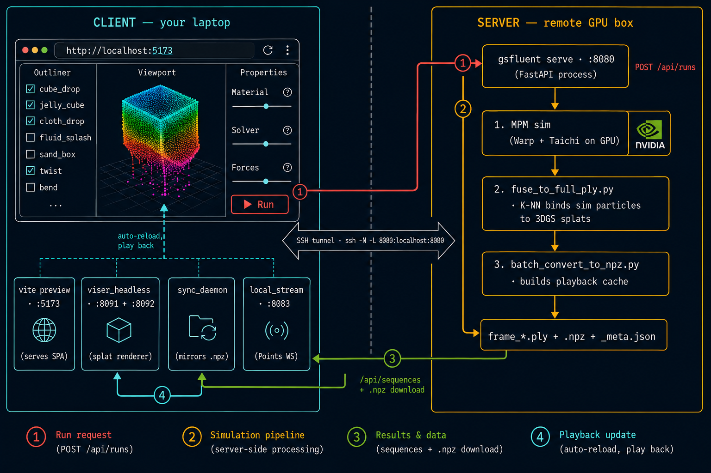

# gsfluent — workbench for animated 3DGS sequences

Browser workbench for inspecting and playing back physics-simulated 3D
Gaussian Splatting sequences. Pick a sequence, scrub the timeline,
switch between point-cloud and splat rendering, orbit the camera.

Simulation runs on a remote server (the GPU box); the client is a
viewer and a gateway to the run/job API. No CUDA, no PyTorch, no
Warp, no Taichi locally — pure-Python deps.

[中文 README](README.md)

## Architecture: strong frontend/backend split

| | server (GPU box) | client (your machine) |
|---|---|---|
| code | `server/` (FastAPI + sim runner) | `frontend/` (React SPA) + `tools/` (viser, sync, Points WS) |
| install | `./setup-server.sh` | `./setup-client.sh` |
| run | `./run-server.sh` | `./run-client.sh` |
| python env | `server/.venv` (uv) — pure API deps | same lockfile + `[client]` extras (viser, numpy) |
| node | not needed | required (Vite build) |

Python deps are managed by [uv](https://docs.astral.sh/uv/) with
`server/uv.lock` checked in — every install resolves to the exact
same versions. Recipients install uv once
(`curl -LsSf https://astral.sh/uv/install.sh | sh`); the setup
scripts handle the rest.

## Install + run

**Server (one-time):**

```bash
ssh <server-host>
cd gsfluent_pkg && ./setup-server.sh
```

**Server (each session):**

```bash
./run-server.sh                    # API on :8080
```

**Client (one-time):**

```bash
cd gsfluent_pkg && ./setup-client.sh
```

**Client (each session):**

```bash
SERVER_SSH=mygpu ./run-client.sh
```

### What `SERVER_SSH` is, with an example

`SERVER_SSH` is an **SSH host alias** — the same name you'd type after
`ssh ` to log into the server. It's read out of your
`~/.ssh/config`:

```ssh-config
# ~/.ssh/config
Host mygpu
    HostName 10.20.30.40        # or gpu.lab.example.com
    User alice
    IdentityFile ~/.ssh/lab_key
    Port 22
```

With that block in place, `ssh mygpu` opens an interactive shell on
the server. `SERVER_SSH=mygpu ./run-client.sh` reuses the same alias
to open a **port-forwarding** SSH connection in the background:

```text
client (your machine)                          server (mygpu)
───────────────────────                        ──────────────────
http://localhost:4173  ◄── vite preview        gsfluent serve
                            (the SPA)             listening on :8080
                                                          ▲
                                                          │
                            ssh -N -L 8080:localhost:8080 mygpu
http://localhost:8080  ─────────────────────────────────► tunnel exit
   (SPA proxies /api here)                              (loopback on the server)
```

Port `:8080` on your laptop is fused to port `:8080` on the server.
The SPA hits `/api/*` (proxied to `localhost:8080` by vite), which is
the tunnel's client end, which is the server's `gsfluent serve`. No
ports are exposed on the public internet — SSH carries everything.
Ctrl-C tears the tunnel down with the rest of the stack.

Got an existing tunnel or a server reachable over the LAN? Skip
`SERVER_SSH` and point directly:

```bash
GSFLUENT_SERVER=http://server.lan:8080 ./run-client.sh
```

This brings up two cooperating servers:

```
   SERVER (run-server.sh)             CLIENT (run-client.sh)

  ┌──────────────────┐               ┌──────────────────────────┐
  │ gsfluent serve   │   /api  HTTP  │ vite preview  :4173      │
  │ :8080            │ ◀────────────▶│  (serves frontend/dist/) │
  │  - REST + /api   │   over SSH    │                          │
  │  - /api/stream   │    tunnel     │ React workbench in       │
  │    (WS, Points)  │               │  browser ┌─────────────┐ │
  │                  │               │          │ iframe :8091│◀┐
  │ runner.py spawns │               │          │ viser splat │ │
  │ MPM sims         │               │          └─────────────┘ │
  └──────────────────┘               │                          │
         ▲                           │ tools/viser_headless.py  │
         │                           │   :8091 + ctl :8092 ─────┘
         │ sync_daemon polls         │ tools/sync_daemon.py
         │ /api/sequences            │ tools/local_stream.py
         └───────────────────────────┴─────  /set, /camera, /sync-status
```

Open `http://localhost:4173` after `./run-client.sh`. Outliner picks
a sequence; the playback bar scrubs frames; the render-mode toggle
switches between **Points** (R3F + int16-quantized xyz over WebSocket)
and **Splats** (viser iframe driven by the control API).

## Where data lives

```
work/
├── library/
│   └── sequences/<name>/
│       ├── frames/frame_NNNN.ply   # fused 3DGS frames (Z-up at rest)
│       ├── frames.bin              # GSSQ-packed int16 xyz (Points mode)
│       ├── manifest.json
│       └── _meta.json
└── cache/
    └── viser/<name>.npz            # Splats-mode playback cache
```

A sequence is the canonical artifact: fused per-frame splat plies plus
optional packed-binary and viser cache files. In the normal flow, you
don't populate this manually:

1. Fire a sim via `POST /api/runs` (or the workbench's Run button).
2. Server's `runner.py` runs sim → fuse → `batch_convert_to_npz.py`
   → writes `_meta.json`.
3. Client's `sync_daemon` mirrors the `.npz` + `_meta.json` to the
   local `work/` tree on its next poll.
4. The outliner picks up the new sequence; viser auto-reloads.

## Render modes

| Mode | Renderer | Transport | What it's good for |
|---|---|---|---|
| **Points** | R3F (three.js) | `/api/stream` WS, int16 xyz via `PackedReader` | Lightweight inspection; works without the viser cache |
| **Splats** | viser iframe | `POST /set`, `POST /camera` to `:8092` | High-quality splat rendering for review and demos |

Both modes share `currentFrameIdx` and `simRunName` from the Zustand
store, so the timeline and outliner drive whichever renderer is
active. Toggling modes does not reset playback state.

## Recipes (sim parameters)

`tools/recipes/*.json` defines material + boundary + integration
parameters consumed by the server-side sim. The schema matches what
the canonical sim script (configured via `$GSFLUENT_SIM_SCRIPT_RUNNER`
on the server) expects.

```bash
ls tools/recipes/
# cluster_6_15_smash.json  demolition.json  jelly.json  earthquake.json  ...
cp tools/recipes/jelly.json tools/recipes/my_recipe.json
```

Editing a recipe locally and submitting a run goes through the server —
see `docs/ARCHITECTURE.md` for the sim-submission flow (work in
progress).

## Layout

```
gsfluent_pkg/
├── README.md                README.en.md      # bilingual
├── setup-client.sh / run-client.sh       # client side
├── setup-server.sh / run-server.sh       # server side
├── docs/ARCHITECTURE.md     # deeper architecture notes
├── server/                  # FastAPI + SPA serving
│   └── gsfluent/
│       ├── api/             # /api/recipes, /api/runs, /api/sequences, /api/stream
│       └── core/            # library scanning, manifest, runner, frame_stream
├── frontend/                # React + Vite + R3F SPA
│   └── src/components/viewport/
│       ├── SplatScene.tsx       # Points mode (R3F)
│       └── ViserSplatScene.tsx  # Splats mode (viser iframe)
├── tools/
│   ├── viser_headless.py        # viser + control API (Splats mode backend)
│   ├── batch_convert_to_npz.py  # builds work/cache/viser/*.npz
│   ├── sequence_to_viser_npz.py # one-sequence converter
│   ├── fuse_to_full_ply.py      # sim_*.ply + ref 3DGS → frame_*.ply
│   ├── pack_sequence.py         # frame_*.ply → frames.bin (GSSQ int16)
│   ├── migrate_to_library.py    # legacy → work/library/ layout
│   ├── vkgs_play.py             # launch the vkgs fork against a sequence
│   └── recipes/                 # JSON recipe presets
└── work/                    # runtime data (library, cache, uploads)
```

## Credits

- 3D Gaussian Splatting: Kerbl et al. 2023
- MPM physics: NVIDIA Warp + Taichi (server-side)
- Splat playback: viser
- Workbench: React + Vite + React Three Fiber
